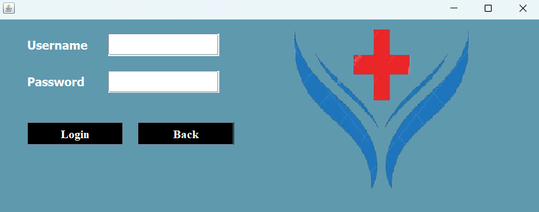
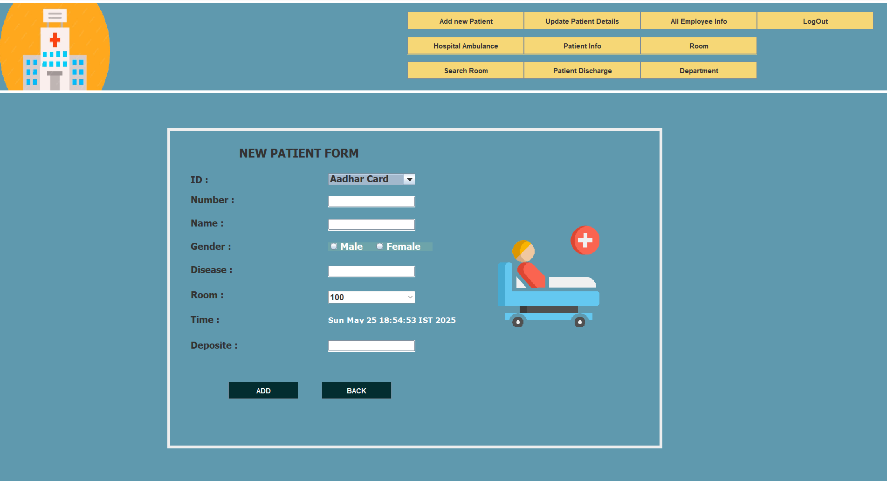

# 🏥 Hospital Management System

A desktop-based Hospital Management System developed in **Java** with a **MySQL** backend. This project is designed to manage and streamline the day-to-day operations of a hospital including patient records, doctor assignments, appointments, billing, and more.

## 📌 Features

- 🧑‍⚕️ **Patient Management**: Add, update, view, and delete patient records.
- 👨‍⚕️ **Doctor Management**: Maintain doctor information and availability.
- 🔐 **User Authentication**: Secure login system for administrators/staff.

## 🛠️ Technologies Used

| Technology         | Purpose                              |
| ------------------ | ------------------------------------ |
| Java (Swing & AWT) | Frontend GUI for desktop application |
| MySQL              | Backend relational database          |
| JDBC               | Java-MySQL connectivity              |
| mysql-connector-j  | Database connector driver            |
| ResultSet2xml      | For result set data exportation      |

## ⚙️ Setup Instructions

1. **Clone the Repository**

   ```bash
   git clone https://github.com/your-username/hospital-management-system.git
   ```

2. Import into your IDE (e.g., Eclipse, IntelliJ)

3. Add External Libraries

- Add mysql-connector-j, jcalendar, and any other .jar files to your build path.

4. Setup MySQL Database

- Import the SQL file from the database/ folder into your MySQL.
- Create a database named hospital (or as mentioned in the project).
- Update your DB credentials in the Java source code:

```
String url = "jdbc:mysql://localhost:3306/hospital";
String user = "your-username";
String password = "your-password";
```

5. Run the Application

- Start from the main entry class (e.g., Main.java or HospitalManagementSystem.java).

## 📸 Screenshots




## 💡 Future Enhancements

- Role-based access control
- SMS/Email appointment reminders
- Integration with cloud database
- Export reports to PDF/Excel

## 📜 License

This project is licensed under the MIT License - see the [LICENSE]() file for details.
